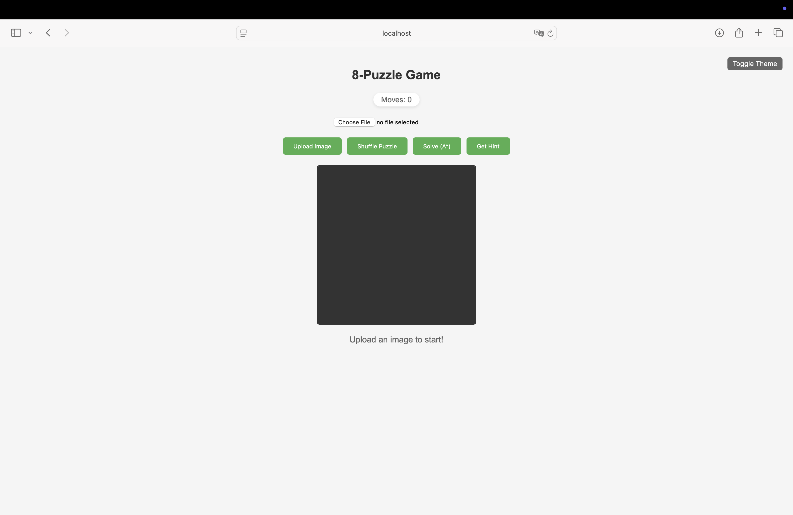
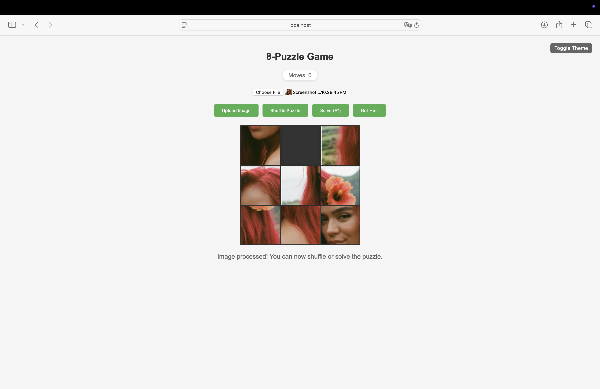
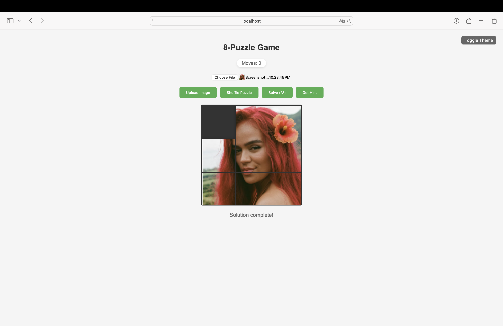

# 8-Puzzle Game with A* Solver

## Project Overview
This project implements an interactive 8-puzzle game with an A* algorithm solver. The game allows users to upload their own images, which are then split into 8 pieces to create a sliding puzzle. The implementation includes both manual solving capabilities and an automatic solver using the A* algorithm.

## Demo
https://youtu.be/pUliJoU1Kv4

## Features
- Image upload and processing
- Interactive puzzle interface
- Manual tile movement
- Automatic puzzle shuffling
- A* algorithm solver
- Visual solution animation
- Responsive design

## Technical Implementation
- **Frontend**: HTML, CSS, JavaScript
- **Backend**: Python with Flask
- **Image Processing**: Pillow (PIL)
- **Algorithm**: A* with Manhattan distance heuristic

## How to Run
1. Ensure you have Python 3.x installed
2. Install the required dependencies:
   ```
   pip install -r requirements.txt
   ```
3. Run the Flask application:
   ```
   python app.py
   ```
4. Open your web browser and navigate to `http://localhost:5000`

## Project Structure
- `app.py`: Main Flask application
- `a_star_solver.py`: Implementation of the A* algorithm
- `utils.py`: Utility functions for image processing and puzzle management
- `templates/index.html`: Frontend interface
- `static/`: Static assets
- `uploads/`: Temporary storage for uploaded images

## How to Play
1. Upload an image using the "Upload Image" button
2. The image will be automatically split into 8 pieces
3. Click on tiles adjacent to the empty space to move them
4. Use the "Shuffle" button to randomize the puzzle
5. Use the "Solve" button to automatically solve the puzzle using A*

### Main Screen


### Shuffle Option


### Solved Screen


## Algorithm Details
The A* algorithm uses the Manhattan distance heuristic to find the optimal solution path. The solver ensures that:
- Only solvable configurations are generated
- The solution path is optimal (minimum number of moves)
- The empty space is properly tracked throughout the solution

## Dependencies
- Flask==3.0.0
- Pillow==10.2.0
- numpy==1.26.4
